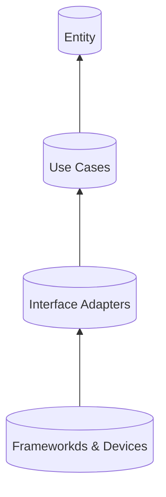

# Clean Architecture

Questions:
- В чем преимущества Clean Architecture?
- На какие слои стоит разбивать приложения?
- Рассказать про каждый.

Sources Used:
- [Clean architectures in iOS](https://habr.com/ru/companies/croc/articles/560674/)
- [Clean Architecture](https://www.geeksforgeeks.org/what-is-clean-architecture-in-android/)

---

## Слои

- **Entity (Enterprise Business Rules)**: бизнес логика
- **Use Cases (App Business Rules)**: логика приложения, описывает процессы внутри приложения
- **Interface Adapters (Presenters)**: слой, позволяющий общаться внешним фреймворкам с приложением
- **Frameworkds & Devices**: внешние фреймворки и/или устройства

> Более верхнии слои не должны ничего знать о нижних

**Плюсы подхода:** 
- Легко тестируемый код
- Понятное разделение ответственностей между слоями

**Минусы подхода:** 
- Высокий порог входа
- Мало документации
- Особенно на больших проектах тяжело следить за тем, чтобы все разработчики понимали арахитектуру одинакого
- Супер много кода и абстракций
