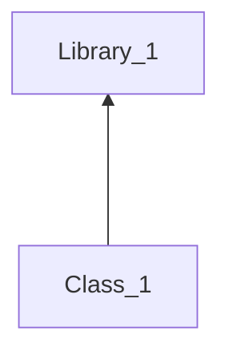
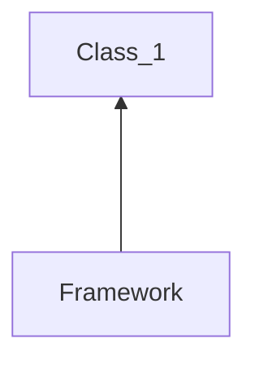

# DI, DIP, IoC

Questions:
- Что обозначают понятия: Inversion of Control (IoC), Dependency Injection (DI), Dependency Inversion Principle (DIP)?

Sources Used:
- [DI vs. DIP vs. IoC](http://sergeyteplyakov.blogspot.com/2014/11/di-vs-dip-vs-ioc.html)

---

## Inversion of Control (IoC)

**Инверсия управления** - это принцип, который способствует разделению компонентов в программной среде. IoC делегирует контроль над сторонними библиотеками фреймворку, который дает необходимые callback'и для расширения.

**Пример класической модели (Pull)** 

**Пример инвертированной модели (Push)** 

## Dependency Injection (DI)

**Внедрение зависимостей** – это механизм передачи классу его зависимостей. Существует несколько конкретных видов или паттернов внедрения зависимостей: внедрение зависимости через конструктор (Constructor Injection), через метод (Method Injection) и через свойство (Property Injection).

* через конструктор передаются обязательные зависимости
* через метод передеются зависимости, которые необходимы только для работы конкретного метода
* через свойство передаются необязательные зависимости (обычно со стандартным значением)

## Dependency Inversion Principle (DIP)

**Принцип инверсии зависимостей** - это принцип проектирования, который говорит, что классы должны зависеть от высокоуровневых абстракций.

_Модули верхнего уровня не должны зависеть от модулей нижнего уровня. И те и другие должны зависеть от абстракций._
