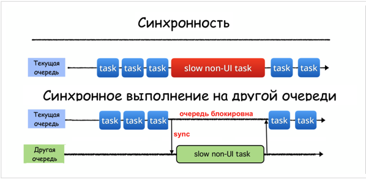
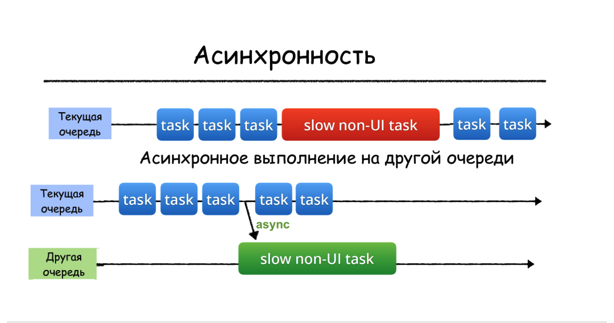

# Grand Central Dispatch

## Primitives

* [ ] - DispatchQueue
* [ ] - DispatchWorkItem
* [ ] - DispatchGroup
* [ ] - DispatchSemaphore
* [ ] - DispatchSource

## DispatchQueue

Очереди в многопоточке - обычные очереди, работающие по принципу FIFO. Только в случае iOS и macOS в очереди мы "кладем" задачи (замыкания).

### Последовательные (`serial`) и параллельные (`concurrent`) очереди

Принцип работы последовательной очереди:
Очередь вытягивает задачи по одной и не достает новую, пока не отработает текущая.

Принцип работы параллельной очереди:
Очередь вытягивает задачу и запускает ее выполнение на определенном потоке. Если у системы еще есть свободные ресурсы, то она вытягивает следующую задачу и выполняет ее уже на другом потоке.


### Синхронное (`sync`) и асинхронное (`async`) выполнение задач

Задачи в очереди можно разместить с помощью функций: `sync`(для синхронного выполнения по отношению к текущей очереди), `async`(для асинхронного выполнения по отношению к текущей очереди)

Синхронная функция возвращает управление на текущую очередь только после полного завершения задания, тем самым блокирую текущую очередь:



Асинхронная же функция немедленно возвращаяет управление на текущую очередь после запуска задачи на другой очереди, не ожидая завершения. Таким образом, асинхронная функция не блокирует выполнение заданий на ткущей очереди.



### Глобальные очереди

1. Последовательная `main` очередь: на ней выполняются все операции связанные с UI. Имеет *наивысший* приоритет выполнения среди глобальных очередей;
2. 4 параллельне очереди с разным качеством обслуживания (qos or Quality of Service):

```swift
// наивысший приоритет
let userInteractiveQueue = DispatchQueue.global(qos: .userInteractive)

let userInitiatedQueue = DispatchQueue.global(qos: .userInitiated)

// по умолчанию 
let defaultQueue = DispatchQueue.global()

let utilityQueue = DispatchQueue.global(qos: .utility)

// самый низкий приоритет
let backgroundQueue = DispatchQueue.global(.background) 
```

### Quality of Service

* `userInteractive` - для задач, которые взаимодействуют с пользователем в данный момент и должны занимать очень мало времени: анимации, жезты и пр. Например, пользователь водит по экрату и приложение должно обрабатывать положение пальца и воспроизводить тяжелые вычисления, которые должны отображаться на экране как можно скорее;
* `userInitiated` - для задач, которые инициируются пользователем и требуют обратной связи, но это не должно происходить мгновенно - пользователь может подождать обратной связи;
* `default` - стандартрный qos для очередей без указаний на качество обслуживания. Задачется с помощью `DispatchQueue.global()`;
* `utility` - для задач, которые требуют некоторого времени для выполнения и не требуют немедленной обратной связи. Например, загрузка данных или очистка некоторой базы данных. Т.е. делается что-то о чем пользователь не просил, но это необходимо для работы приложения;
* `background` - для задач, не связанных с визуализацие и не критичных ко времени выполнения. Например, бэкапы или синхронизация с web сервисом.

# Links

1. deep dive into gcd: https://www.swiftbysundell.com/articles/a-deep-dive-into-grand-central-dispatch-in-swift/;
