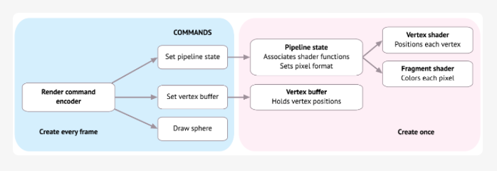
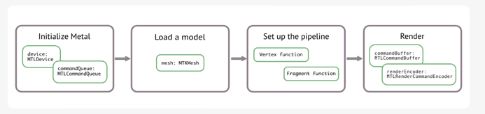

# LINKS:
- Kodeco book: https://www.kodeco.com/books/metal-by-tutorials/v3.0/chapters/ii-book-source-code-forums
- Kodeco free guide: https://www.kodeco.com/7475-metal-tutorial-getting-started#toc-anchor-017
- Apple WWDC Metal videos: https://developer.apple.com/videos/wwdc2014/?q=metal
- Archived apple's documentation: https://developer.apple.com/library/archive/documentation/Miscellaneous/Conceptual/MetalProgrammingGuide/Introduction/Introduction.html
- Apple sample code library: https://developer.apple.com/documentation/metal/metal_sample_code_library

# TUTOR 1

## Theory 

Model rendering process (*_Rendering pipeline_*):

model loader reads verticies -> renderer pass them to GPU -> shader func process them (add shader and etc...)

*Rendering pipeline* - это список команд и ресурсов (вершины, материалы, свет и т.д.), создающих финальную картинку.

Sequence of drawing models:

Init metal -> Load a model -> Set up the pipeline -> render

## Programming

```
Metal -> MetalKit -> ...
            |
            v
         ModelIO  -> ...
```

Algorithm of creating a model:
1. create allocator (it is manages backward compatibility of ModelIO Mesh and Metal Mesh
2. create ModelIO Mesh
3. from ModelIO Mesh create MetalKit Mesh

```
CommandQueue -> Command buffer -> Command encoder (wrapped in encoder command to GPU)
                               -> Command encoder
             -> Command buffer
```





# Glossary 

Device - GPU

# TUTOR 3

Objects that should be created outside of render loop:

1. `MTLDevice`
2. `MTLCommandQueue`
3. `MTLLibrary`: contains the source code for shader functions
4. `MTLRenderPipelineState`: sets the information for the drawing - which shader function to use, what depth and color settings to use and etc
5. `MTLBuffer`: holds the data (vertex information for instance) in a form that GPU can read
