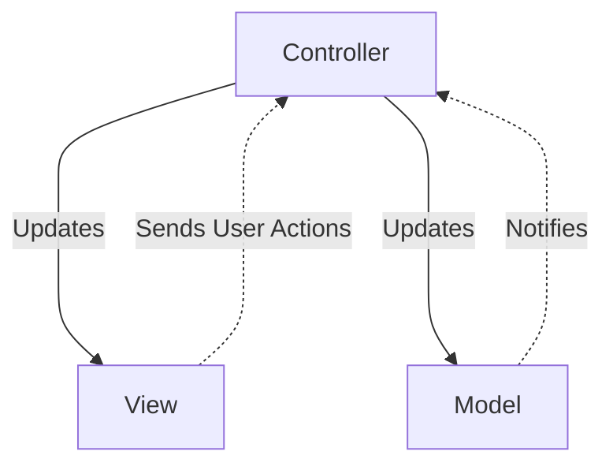
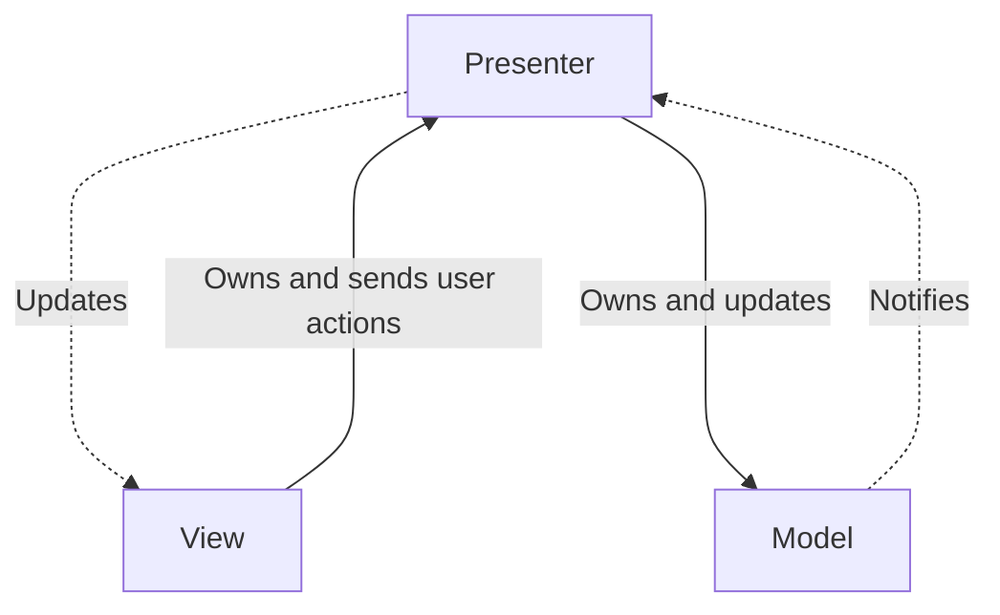
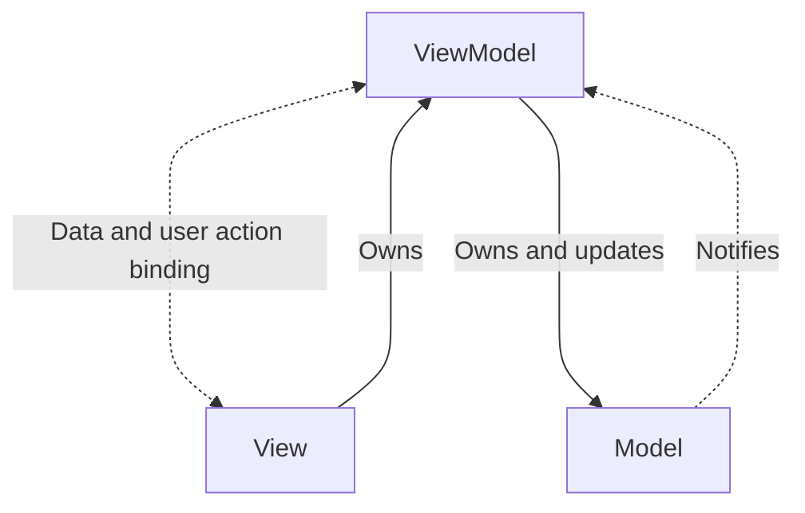
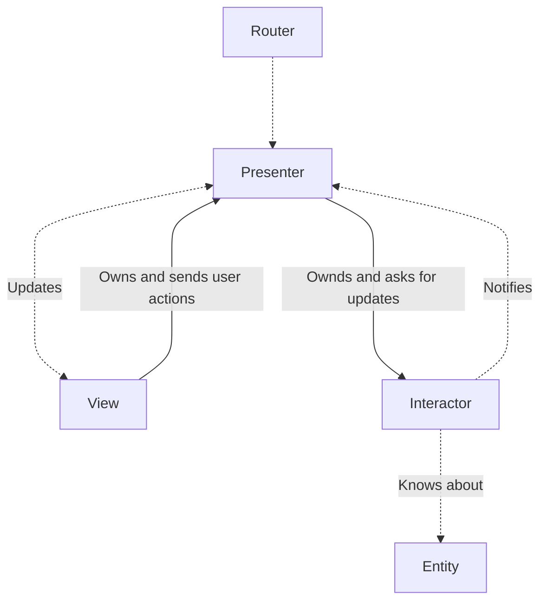

---
tags:
  - ios/uiarchitecture
---

# iOS Architecture patterns

Questions:
- Какие сущности присутствуют в архитектурных шаблонах Apple MVC, MVP, MVVM, VIPER?
- За что отвечает каждая из них?
- Какие есть преимущества и недостатки у каждого архитектурного шаблона?

Sources Used:
- [iOS architecture patterns shortly](https://medium.com/ios-os-x-development/ios-architecture-patterns-ecba4c38de52)

---

## Apple MVC

**M** - Model (data access layer): слой сообщающийся с data model<BR>
**V** - View (GUI): слой ответстввенный за показ информации пользователю<BR>
**C** - Controller: слой ответственный за сообщение модели и GUI. Он отвечает за обновление Model, обновление View и обработку действий пользователя<BR>



### Пример

```swift
struct Product {
    let title: String
}

class ProductsTableView: UITableView {
}

class ProductsViewController: UIViewController, UITableViewDataSource {
    private let productsTableView = ProductsTableView()
    private let products: [Product]

    override func viewDidLoad() {
        super.viewDidLoad()

        productsTableView.dataSource = self
    }

    func tableView(_ tableView: UITableView, cellForRowAt indexPath: IndexPath) -> UITableViewCell {
        let cell = ...

        cell.title = products[indexPath.row].title
        
        return cell
    }
}
```

**Преимущества:**<BR>
- Каждый (даже молодой) разработчик знаком с MVC
- Позволяет быстро развивать проект на ранних этапах

**Недостатки:**<BR>
- Controller слишком крепко связан с View, что ухудшает тестируемость и переиспользуемость
- Большие проекты будет сложно поддерживать, т.к. Controller, будет отвечать за слишком большое количество вещей, что приведет к ухудшению читаемости и увеличению количества вероятных багов с новыми доработками

## MVP

**M** - Model (data access layer): слой сообщающийся с data model<BR>
**V** - View (GUI): слой ответстввенный за показ информации пользователю. В данном случае представлен `UIViewController`/`UIView`<BR>
**P** - Presenter: слой ответственный за сообщение модели и GUI. Он отвечает за обновление Model, обновление View и обработку действий пользователя<BR>



### Пример

```swift
enum PaymentMethodType {
    case bankCardOnline
    case bankCard
    case cash

    var description: String {
        switch {
            // some fancy description here
        }
    }
}

protocol ChoosePaymentMethodView: AnyObject {
    func choose(paymentMethod: PaymentMethodType)
}

protocol ChoosePaymentMethodViewPresenter {
    func choosePaymentMethod(atIndex index: Int)
}

final class ChoosePaymentMethodPresenter {

    private let paymentMethods: [PaymentMethodType]
    
    weak var view: ChoosePaymentMethodView?

    init(paymentMethods: [PaymentMethodType]) {
        self.paymentMethods = paymentMethods
    }

    func choosePaymentMethod(atIndex index: Int) {
        view?.choose(paymentMethod: paymentMethods[index])
    }
}

final class ChoosePaymentMethodViewController: UIViewController, ChoosePaymentMethodView, UITableViewDelegate {

    private let paymentMethodsTableView = UITableView()
    private let chooseButton = UIButton()

    var presenter: ChoosePaymentMethodViewPresenter?

    // MARK: - UITableViewDelegate

    func tableView(_ tableView: UITableView, didSelectRowAt indexPath: IndexPath) {
        presenter?.choosePaymentMethod(atIndex: indexPath.row)
    }

    // MARK: - ChoosePaymentMethodView

    func choose(paymentMethod: PaymentMethodType) {
        chooseButton.isEnabled = true
        chooseButton.setTitle("Select \(paymentMethod.description)", for: .normal)
    }
}
```

**Преимущества:**<BR>
- Бизнес логика легко тестируется и переиспользуется
- Простая концепция, легко влиться новичкам

**Недостатки:**<BR>
- Очень много кода

## MVVM

**M** - Model (data access layer): слой сообщающийся с data model<BR>
**V** - View (GUI): слой ответстввенный за показ информации пользователю<BR>
**VM** - ViewModel: слой ответственный за сообщение модели и GUI. Он отвечает за обновление Model, обновление View и обработку действий пользователя<BR>



> В MVVM View имеет больше обязанностей, чем в MVP, т.к. она сама отвечает за обновление данных через bindings во ViewModel

### Пример

```swift
enum PaymentMethodType {
    case bankCardOnline
    case bankCard
    case cash

    var description: String {
        switch {
            // some fancy description here
        }
    }
}

protocol ChoosePaymentMethodViewModelProtocol {
    var selectedPayment: Published<PaymentMethodType>? { get set }
}

final class ChoosePaymentMethodViewModel: ChoosePaymentMethodViewModelProtocol {

    private let paymentMethods: [PaymentMethodType]

    var selectedPayment: Published<PaymentMethodType>?
}

final class ChoosePaymentMethodViewController: UIViewController, UITableViewDelegate {

    private let paymentMethodsTableView = UITableView()
    private let chooseButton = UIButton()

    private var subscriptions = Set<AnyCancellable>()

    var viewModel: ChoosePaymentMethodViewModelProtocol?

    func subscribe() {
        viewModel?.selectedPayment?.projectedValue.sink { [weak self] paymentType in
            self?.choose(paymentMethod: paymentType)
        }
        .store(in: &subscriptions)
    }

    func choose(paymentMethod: PaymentMethodType) {
        chooseButton.isEnabled = true
        chooseButton.setTitle("Select \(paymentMethod.description)", for: .normal)
    }
}
```

**Преимущества:**<BR>
- Немного меньше кода, чем в MVP
- Наследует преимущества MVP

**Недостатки:**<BR>
- Реактивщина

## VIPER

**V** - View (GUI): слой ответстввенный за показ информации пользователю<BR>
**I** - Interactor: слой отвечающий за бизнес логику. Знает о моделях данных (Entity)<BR>
**P** - Presenter: слой сожержащий логику относящуюся к UI (но независиммую от SwiftUI/UIKit), дергает методы Interactor'а<BR>
**E** - Entity: объекты информации (не Data access layer, за это отвечает Interactor)<BR>
**R** - Router: слой отвечающий за навигацию между VIPER модулями<BR>



### Пример

```swift
struct Person {
    let firstName: String
    let lastName: String
}

struct GreetingData {
    let greeting: String
    let subject: String
}

protocol GreetingProvider {
    func provideGreetingData()
}

protocol GreetingOutput: class {
    func receiveGreetingData(greetingData: GreetingData)
}

class GreetingInteractor: GreetingProvider {
    weak var output: GreetingOutput?
    
    func provideGreetingData() {
        let person = Person(firstName: "David", lastName: "Blaine")
        let subject = person.firstName + " " + person.lastName
        let greeting = GreetingData(greeting: "Hello", subject: subject)
        self.output?.receiveGreetingData(greeting)
    }
}

protocol GreetingViewEventHandler {
    func didTapShowGreetingButton()
}

protocol GreetingView: class {
    func setGreeting(greeting: String)
}

class GreetingPresenter: GreetingOutput, GreetingViewEventHandler {
    weak var view: GreetingView?
    var greetingProvider: GreetingProvider?
    
    func didTapShowGreetingButton() {
        self.greetingProvider?.provideGreetingData()
    }
    
    func receiveGreetingData(greetingData: GreetingData) {
        let greeting = greetingData.greeting + " " + greetingData.subject
        self.view?.setGreeting(greeting)
    }
}

class GreetingViewController: UIViewController, GreetingView {
    let showGreetingButton = UIButton()
    let greetingLabel = UILabel()

    var eventHandler: GreetingViewEventHandler?

    override func viewDidLoad() {
        super.viewDidLoad()
        self.showGreetingButton.addTarget(self, action: Selector(didTapButton(:)), forControlEvents: .touchUpInside)
    }
    
    func didTapButton(button: UIButton) {
        self.eventHandler?.didTapShowGreetingButton()
    }
    
    func setGreeting(greeting: String) {
        self.greetingLabel.text = greeting
    }
}
```

**Преимущества:**<BR>
- Превосходная тестируемость модулей
- Легкое использование, переиспользование и поддержка каждого отдельного компонента

**Недостатки:**<BR>
- Сложность понимания и погружения в архитектуру
