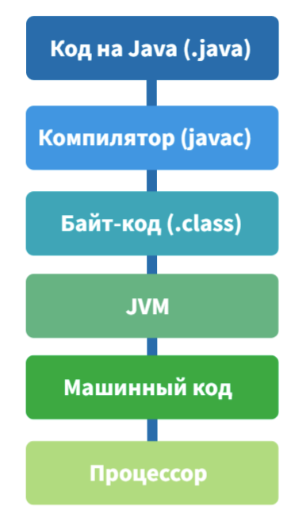

# Java

## Главные особенности

Java is an object oriented language, whose main advantages are:

1. Garbage collector: separate program running in parallel whit java program
   and collecting (freeing) all unused objects to free memory
2. JVM: separate program in which java program can be run. This allows java
   programs to be cross platform as all the client needs for running a program
is a JVM realizatio program on their machine. Moreover, JVM is sandbox. This
means that running java program is isolated in this sandbox and don't have
access to resources outside of the JVM

### JVM

With JVM there is an additional step in compilation of the java programs. While normally compilation is a two step process, where high level code compiles into machine code, that can be run on the computer, java compiles differently:

For running java applications there is a JRE program. **JRE (Java Runtime Environment)** - JVM implementation whithout compiler or other developer programs. JRE "eats" compiled java program and runs it in a sandbox.

For developing java programs it is essential to have **JDK (Java Development Kit)** - a kit of java development instruments like: compiler, debugger, standard lib and etc.
